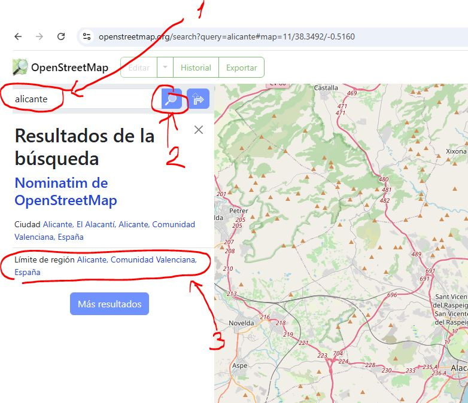
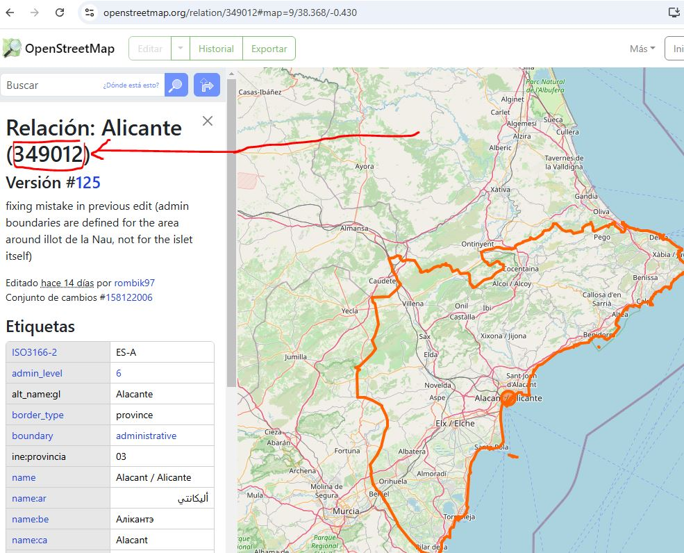
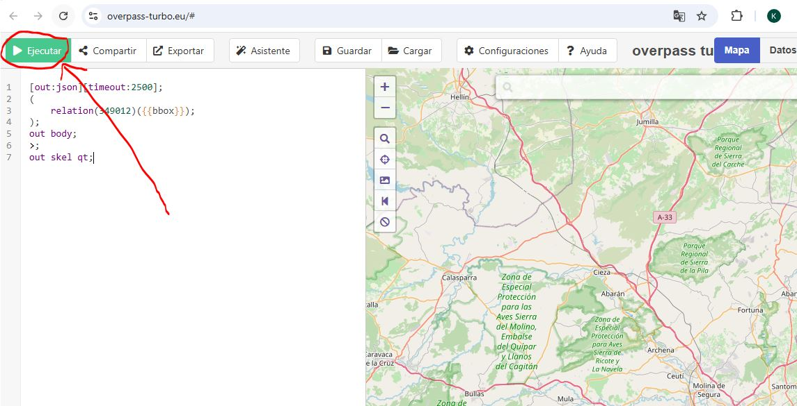
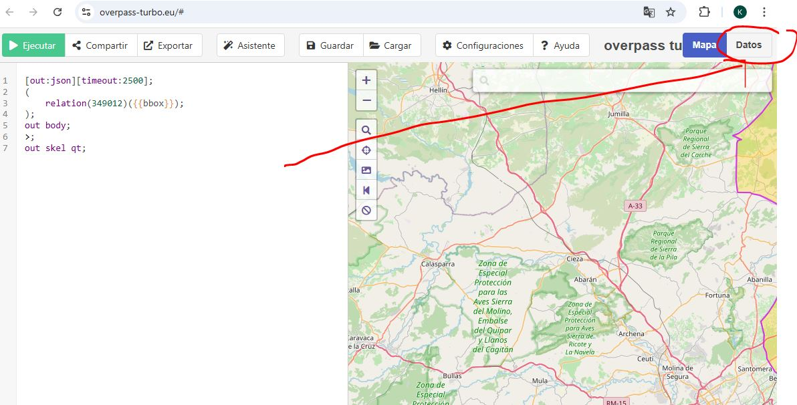
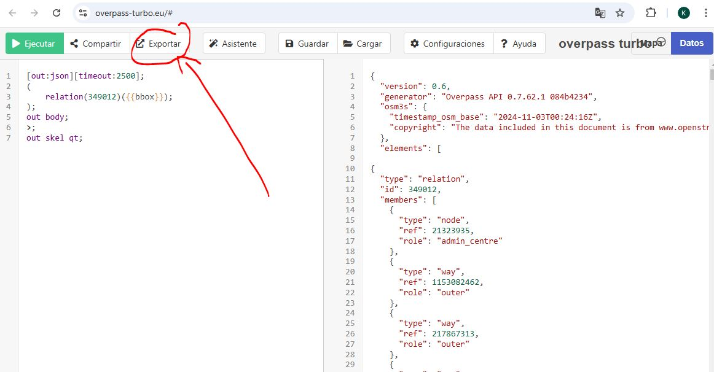
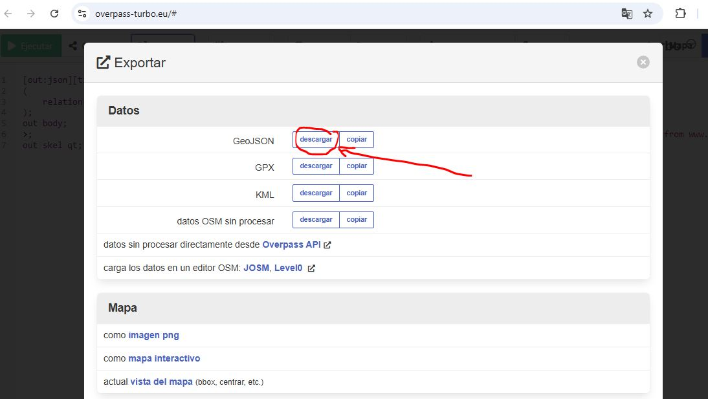

# Obtener los límites de las regiones

Los límites son miles de coordenadas relaccionadas por un código.


Vamos a openstreetmap: https://www.openstreetmap.org/#map=9/38.322/-1.802

En el cuadro de búsqueda escribimos la comunidad o región para ver si está su límite creado.

Como podemos comprobar el de Alicante está creado, pinchamos en él:



Copia su relación: 



Ve a la web de over-pass-turbo: https://overpass-turbo.eu/

Pega la relación con este formato en el cuadro de la izquierda y pincha en Ejecutar:

```	
[out:json][timeout:2500];
(
    relation(349012)({{bbox}});
);
out body;
>;
out skel qt;
```	




Ahora pinchamos en el botón de datos que está a la derecha:



Para poder obtener el archivo json que después leeremos con python tenemos que pinchar en exportar:



Por último descargamos el archivo GeoJson:



Para trabajar con este archivo en python instalamos el paquete geoson:

#https://pypi.org/project/geojson/

El código sería el siguiente:

``` Python
import geojson

coordenates=[]
f=open("alicante.geojson", encoding="utf8")
gj = geojson.load(f)
features = gj['features'][0]
list_coordinates = features['geometry']['coordinates']
cantidad=len(list_coordinates[0][0])
for number,coord in enumerate(list_coordinates[0][0]):
    lat=float(coord[1])
    long=float(coord[0])
    coordenates.append((lat,long))
poligono=map_widget.set_polygon(coordenates, outline_color="red",border_width=10, command=self.click_poligono, name="Alicante")
    