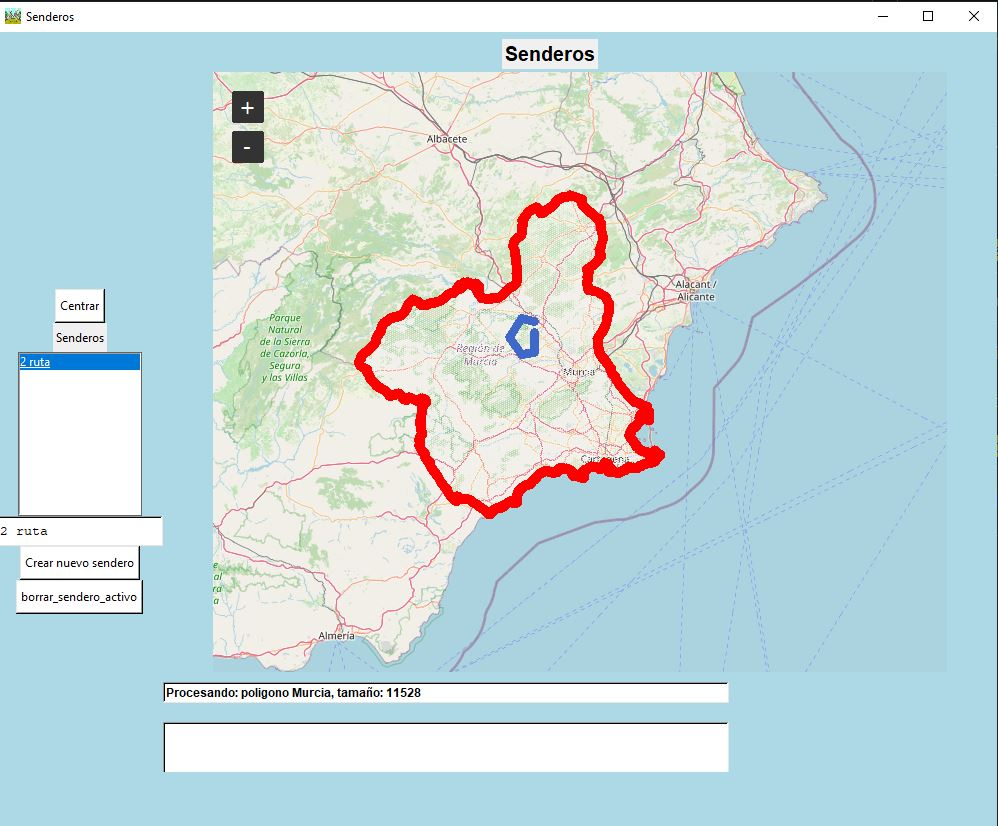

# ¿ Que es senderos ?

Programa para practicar y ayudar a Pablo a hacer su programa de senderos, al mismo tiempo crear polígonos para Carlos.

Está dividido en dos partes:

1. TkinterMapView: Utilizando python con el widget de tkintermapview
2. Flet: Utilizando la librería flet que permite crear aplicaciones web, ios y android utilziando python pero con componentes prediseñados.
3. Android: utilizando kotlin

# tkintermapview

Es un programa de TomSchimansky: https://github.com/TomSchimansky/TkinterMapView?tab=readme-ov-file#importing

Se conecta al servidor openstreetmap: https://es.wikipedia.org/wiki/OpenStreetMap, https://www.openstreetmap.org/#map=6/40.01/-2.49

1. Crea u entorno virtual con "python -m venv venv"
2. Activa el entorno virtual con "source venv/bin/activate" en linux o "venv\Scripts\activate.bat" en windows
3. Selecciona el python interpreter en vscode
4. escribe en el terminal: pip install tkintermapview
 
 

# Flet

Flet es una herramienta para crear aplicaciones web, ios y android con componentes prediseñados: https://flet.dev

El componente mapa está aquí: https://flet.dev/docs/controls/map/

1. Instala flet con pip install flet
2. Ejecuta la aplicación situandote en la carpeta del proyecto  y escribe en el terminal "flet run"
3. Crea una aplicación android con flet

   
# Android

Abre la aplicación con android estudio y deja que se carguen las dependencias.